<!-- README.md is generated from README.Rmd. Please edit that file -->

# nzpullover

[](https://travis-ci.org/nacnudus/nzpullover)
[](https://ci.appveyor.com/project/nacnudus/nzpullover)
[](https://cran.r-project.org/web/packages/nzpullover/index.html)
[](https://www.r-pkg.org/pkg/nzpullover)

The nzpullover package makes available road policing data from the New
Zealand Police in a convenient ‘tidy’ form. Offence categories include
speed, alcohol, red light, restraints (seatbelts), mobile phone, fleeing
drivers, and speeding police vehicles.

The original data published by the New Zealand Police is available as a
spreadsheet here:
[http://www.police.govt.nz/about-us/publication/road-policing-driver-offence-data-january-2009-june-2018](http://www.police.govt.nz/sites/default/files/publications/road-policing-driver-offence-data-1jan2009-30june2018.xlsx).
Please note that this R package is not associated with the New Zealand
Police.

The spreadsheet data has been made tidy by using the
[tidyxl](https://github.com/nacnudus/tidyxl) and
[unpivotr](https://github.com/nacnudus/unpivotr) packages. See the
scripts in
[/data-raw](https://github.com/nacnudus/nzpullover/tree/master/data-raw).
Zipped csv files are available in
[/inst/extdata](https://github.com/nacnudus/nzpullover/tree/master/inst/extdata).

The New Zealand Police refresh the data approximately quarterly. If this
package lags behind, then please open an issue
<https://github.com/nacnudus/nzpullover/issues>. The CRAN version will
be updated annually.

## Installation

You can install nzpullover from github with:

``` r
# install.packages("devtools")
devtools::install_github("nacnudus/nzpullover")
```

## Example

Scroll to the bottom for lots more graphs.

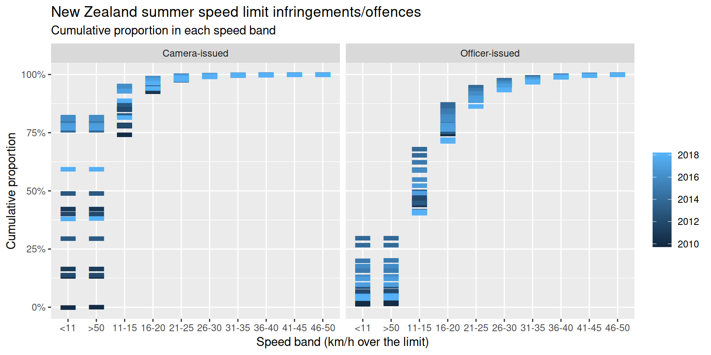

``` r
glimpse(driving_offences)
#> Observations: 62,345
#> Variables: 6
#> $ category <chr> "Red Light", "Red Light", "Red Light", "Red Light", "...
#> $ value    <dbl> 78, 105, 123, 138, 88, 101, 72, 121, 96, 157, 123, 97...
#> $ series   <chr> "Officer issued red light", "Officer issued red light...
#> $ district <chr> "Auckland", "Auckland", "Auckland", "Auckland", "Auck...
#> $ area     <chr> "Auckland Central Area", "Auckland Central Area", "Au...
#> $ month    <date> 2009-01-01, 2009-02-01, 2009-03-01, 2009-04-01, 2009...
glimpse(static_camera)
#> Observations: 5,522
#> Variables: 8
#> $ value    <dbl> 888, 12, 60, 1657, 973, 898, 108, 233, 374, 369, 522,...
#> $ series   <chr> "Static Camera-issued speed offences by site", "Stati...
#> $ district <chr> "AUCKLAND CITY", "AUCKLAND CITY", "AUCKLAND CITY", "A...
#> $ area     <chr> "AUCKLAND EAST AREA", "AUCKLAND EAST AREA", "AUCKLAND...
#> $ site     <chr> "AC0008", "AC0008", "AC0009", "AC0009", "AC0009", "AC...
#> $ road     <chr> "REMUERA ROAD", "REMUERA ROAD", "ELLERSLIE-PANMURE HI...
#> $ section  <chr> "BETWEEN KORAHA STREET AND MEADOWBANK ROAD", "BETWEEN...
#> $ month    <date> 2009-01-01, 2009-02-01, 2009-09-01, 2009-10-01, 2009...
glimpse(excess)
#> Observations: 21,667
#> Variables: 6
#> $ value    <dbl> 27, 84, 109, 66, 17, 3, 4, 1, 1, 65, 178, 85, 37, 8, ...
#> $ series   <chr> "Officer-issued excess speed band", "Officer-issued e...
#> $ district <chr> "Auckland", "Auckland", "Auckland", "Auckland", "Auck...
#> $ area     <chr> "Auckland Central Area", "Auckland Central Area", "Au...
#> $ speed    <chr> "<11", "11-15", "16-20", "21-25", "26-30", "31-35", "...
#> $ month    <date> 2009-12-01, 2009-12-01, 2009-12-01, 2009-12-01, 2009...
glimpse(fleeing_area)
#> Observations: 21,090
#> Variables: 5
#> $ value    <dbl> 0, 0, 0, 10, 11, 4, 8, 4, 7, 6, 3, 2, 0, 0, 0, 3, 7, ...
#> $ series   <chr> "Fleeing driver incidents where Area-level detail is ...
#> $ district <chr> "Auckland", "Auckland", "Auckland", "Auckland", "Auck...
#> $ area     <chr> "Auckland Central Area", "Auckland Central Area", "Au...
#> $ month    <date> 2009-01-01, 2009-02-01, 2009-03-01, 2009-04-01, 2009...
glimpse(fleeing_district)
#> Observations: 6,840
#> Variables: 4
#> $ value    <dbl> 10, 14, 26, 22, 24, 17, 27, 19, 21, 15, 18, 14, 18, 6...
#> $ series   <chr> "Fleeing driver incidents by district", "Fleeing driv...
#> $ district <chr> "Auckland City", "Auckland City", "Auckland City", "A...
#> $ month    <date> 2009-01-01, 2009-02-01, 2009-03-01, 2009-04-01, 2009...
glimpse(police_speeding)
#> Observations: 6,906
#> Variables: 5
#> $ value    <dbl> 2, 4, 3, 1, 1, 2, 4, 1, 6, 1, 1, 1, 2, 1, 1, 1, 1, 3,...
#> $ series   <chr> "Police vehicle speed - detections by speed camera", ...
#> $ district <chr> "Auckland", "Auckland", "Auckland", "Auckland", "Auck...
#> $ area     <chr> "Auckland East", "Auckland East", "Auckland East", "A...
#> $ month    <date> 2009-03-01, 2009-04-01, 2009-05-01, 2009-06-01, 2009...
glimpse(police_speeding_band)
#> Observations: 1,955
#> Variables: 6
#> $ value    <dbl> 15, 4, 1, 1, 2, 1, 6, 1, 1, 9, 2, 3, 2, 1, 1, 2, 11, ...
#> $ series   <chr> "Police vehicle speed detections by calendar year* an...
#> $ district <chr> "Auckland", "Auckland", "Auckland", "Auckland", "Auck...
#> $ area     <chr> "Auckland East", "Auckland East", "Auckland East", "A...
#> $ speed    <chr> "11-15", "16-20", "21-25", "26-30", "31-35", "46-50",...
#> $ year     <date> 2009-01-01, 2009-01-01, 2009-01-01, 2009-01-01, 2009...
```

## Other New Zealand datasets by the same author:

  - [nzlifetables](https://github.com/nacnudus/nzlifetables) – cohort
    life tables
  - [nzcensus2013](https://github.com/nacnudus/nzcensus2013) – summary
    statistics from the 2013 New Zealand census
  - [nzbabynames](https://github.com/nacnudus/nzbabynames) – the top 100
    baby names annually since 1954, and annual birth
statistics.

## Lots more graphs

<!-- --><!-- --><!-- -->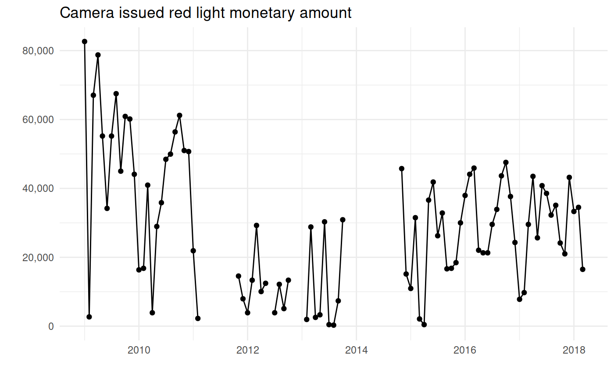<!-- --><!-- -->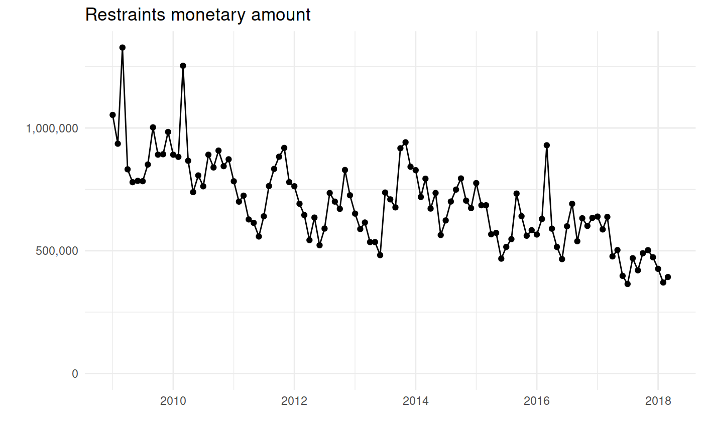<!-- --><!-- -->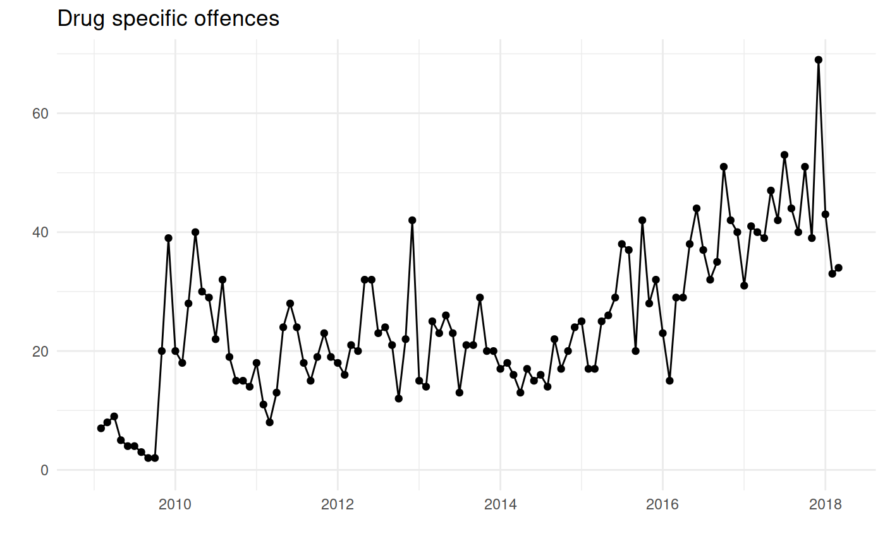<!-- -->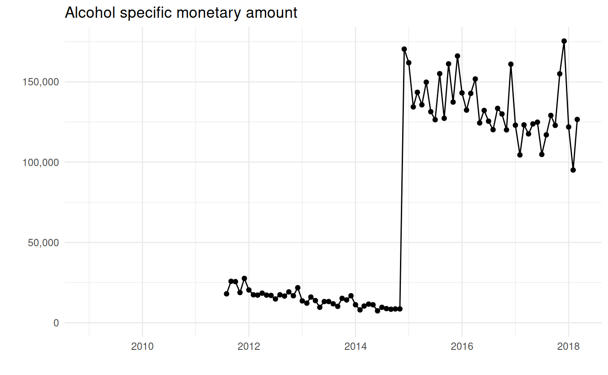<!-- -->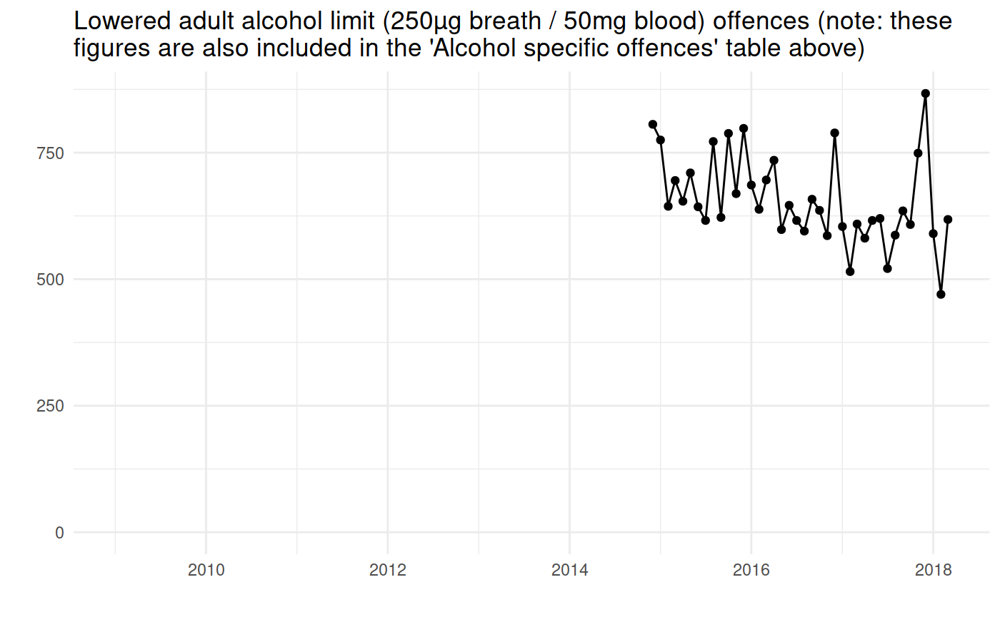<!-- --><!-- -->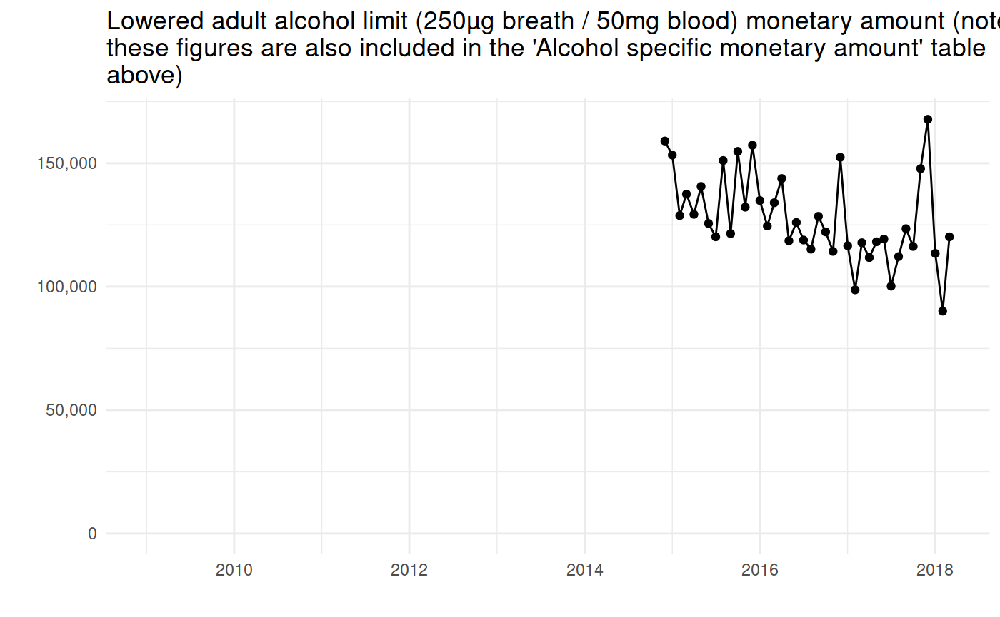<!-- -->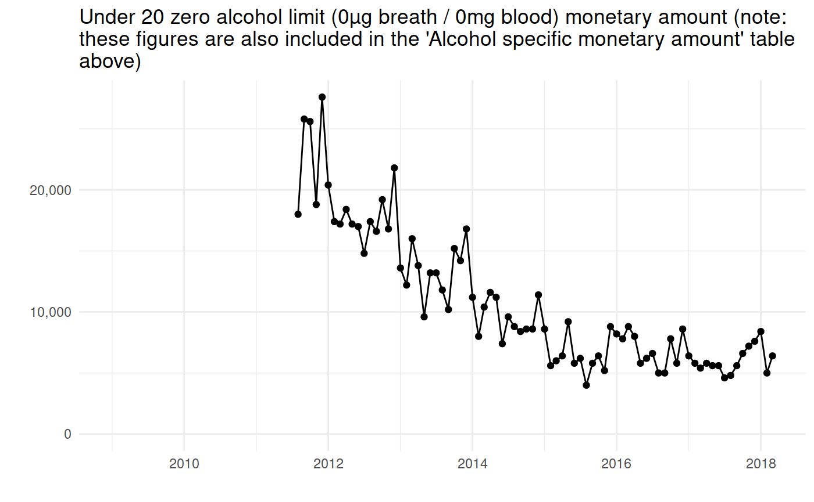<!-- -->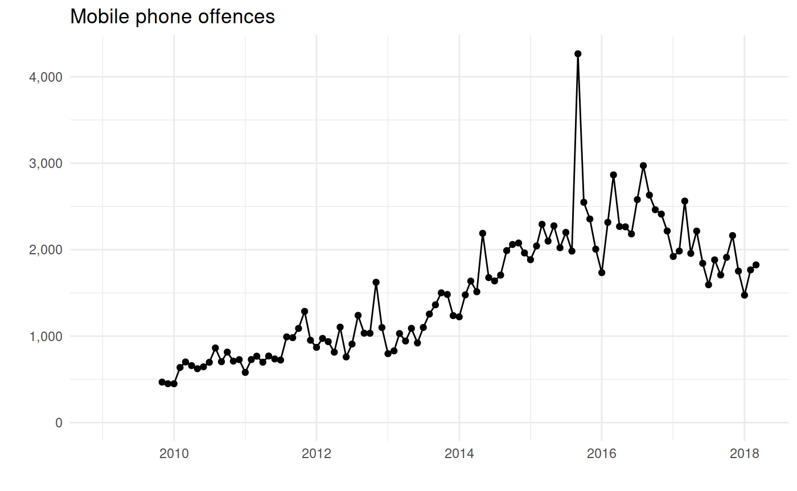<!-- -->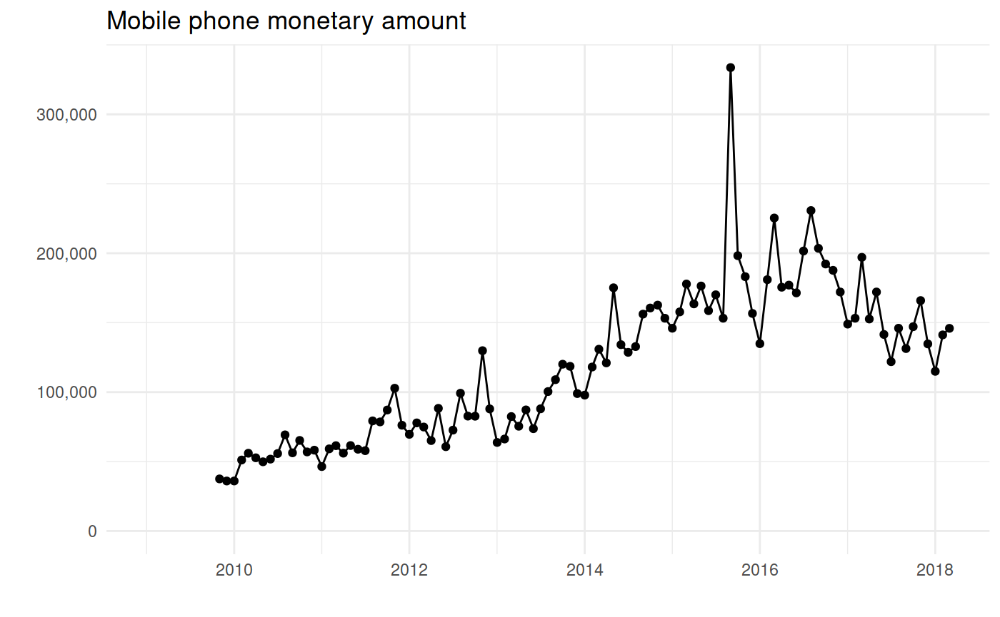<!-- -->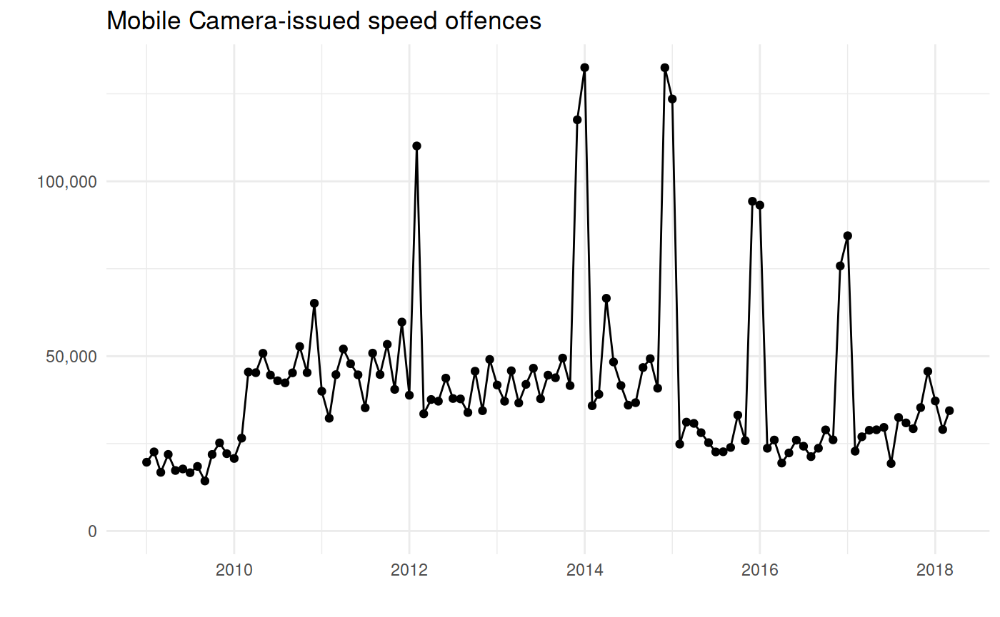<!-- -->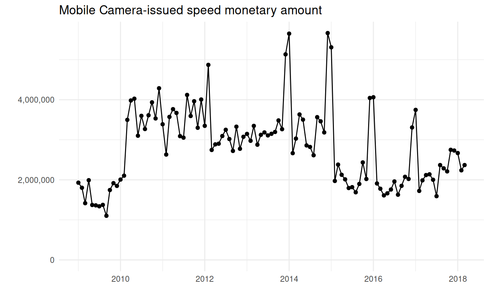<!-- --><!-- --><!-- --><!-- -->
